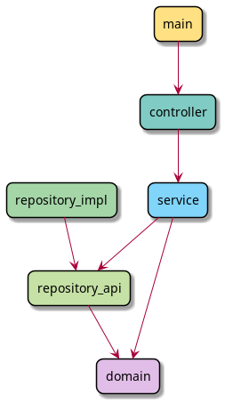

# Project Architecture

This project is organized as a multi-module Maven application with a layered architecture.
Each module has a clearly defined responsibility and depends only on modules in lower layers.

The goal of this structure is to:
- separate concerns between application layers
- keep the domain model independent from infrastructure
- allow infrastructure implementations to be replaced without affecting business logic

## Modules

| Module | Responsibility |
|------|------|
| `main` | Application entry point and bootstrapping |
| `controller` | External interface layer |
| `service` | Application use cases and business workflows |
| `repository-api` | Persistence abstraction (repository interfaces) |
| `repository-impl` | Concrete persistence implementations |
| `domain` | Core business model |

## Dependency Structure

The modules depend on each other according to the diagram 

